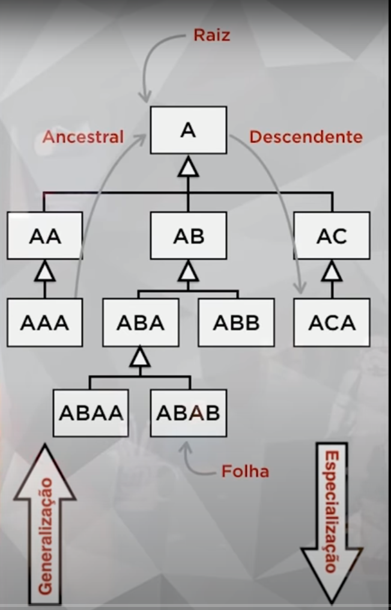

# Orientação a objetos

Vantagens da Orientação a objetos:

- Confiável: O isolamento entre as partes gera software seguro. Ao alterar uma parte, nenhuma outra é afetada. 
- Oportuno: Ao dividir tudo em partes, várias delas podem ser desenvolvidas em paralelo
- Manutenível: Atualizarum software é mais fácil. Uma pequena modificação vai beneficiar todas as partes que usarem o objeto
- Extensível: O princípio da extensibilidade diz que o software não é estático. Ele deve crescer para permanecer útil
- Reutilizável O próprio nome já descreve (:, mas a base é você poder reaproveitar objetos, classes, interfaces criadas para um projeto A em um projeto B futuro. O Guanabara cita um exemplo de você modelar uma classe aluno para uma escola e poder reaproveitar a mesma classe em um outro projeto, por exemplo, de uma academia(que também tem alunos)  
- Natural: todo software orientado a objeto ele tem que ser natural. O princípio diz que uma coisa natural é mais fácil de você entender. Você se preocupa mais na funcionalidade do que nos detalhes de implementação.

*PS: lembrar do controle remoto.*  
  - estado: desligado/ligado  
  - consigo usar: pause, canais, volume  
  - caraterísticas: cor, modelo..  

## Pilares da programação orientada a objetos

Conceito de pilar muitas vezes pensamos "po, tem que ter sustentação, para ter o segundo pilar(herança), preciso ter o primeiro(encapsulamento)", mas se tratando de herança e encapsulamento não existe essa obrigatoriedade. O que existe mesmo é um ideal de boas práticas, mas teu código não te obriga a seguir isso. Nesse quesito, só muda quando estamos trabalhando com polimorfismo.

## Abstração

Abstrair é você considerar somente aquilo que te importa em determinado contexto ou num determinado momento de programação de uma classe, por exemplo. Representa uma entidade, incluindo apenas seus atributos mais relevantes.

Trata a representação de um conceito da vida real dentro do sistema. Por exemplo um usuário dentro do seu sistema/app - quais são as características que o seu usuário precisa ter? ele precisa de cpf, data de nascimento ou só nome e email?
Levando em consideração que um usuário é uma pessoa, você precisa ter na sua classe todos atributos que uma pessoa tem? quais são os métodos que você precisa no contexto de um sistema? tipo, a pessoa precisa do método TOMAR CERVEJA dentro do teu sistema?

Em relação ao estado, qual o estado importante pra você naquele contexto? tem algo sobre estar feliz ou triste? isso é uma informação importante? ou você precisa só saber se seu usuário tá online ou offline? realizou ou não uma compra? etc

## Encapsulamento

Ocultar partes independentes da implementação, permitindo construir partes invisíveis ao mundo exterior. Você pode conversar com essa capsula. A conversa, a troca de informações da capsula com o mundo externo, chamamos de mensagem. Você não vai "entrar" nessa capsula, você irá apenas trocar mensagens com ela. Um código encapsulado usa interfaces(moldes) e esses __moldes padrão__ vão fazer com que não importa como eu fizer no código o que importa mesmo é se o resultado será sempre o mesmo. Usando o exemplo lúdico das pilhas(duracel, rayovac, panasonic...), a gente sabe qual o modelo específico de pilha que o nosso controle remoto precisa, não importa qual a marca que eu vou comprar, o importante é que essa marca forneça o modelo específico de pilha que eu preciso.

Encapsulamento é a característica da POO que permite separar o programa em várias partes menores e independentes. Cada parte possui sua implementação isolada e realiza seu trabalho de forma autônoma. Com essa característica é possível ocultar os detalhes internos de cada parte através de uma interface.

__É obrigatório?__ Encapsular não é obrigatório, mas é uma boa prática para produzir classes mais eficientes.  

A ideia do encapsulamento é você proteger sua classe do mundo externo e que todas as trocas de mensagens aconteçam por meio da sua interface.

Sempre lembrar que um objeto bem encapsulado, possui uma interface bem definida!

E quais são as vantagens de encapsular?

1 - Tornar mudanças invisíveis (se eu precisar mudar um software por dentro e ele estiver bem encapsulado, mantendo a interface eu posso trocar "a pilha" contanto que a "energia" seja mandada no mesmo padrão. E o mesmo vale pra quando estamos pensando em banco de dados, apis utilizadas, etc).

2 - Facilitar reutilização de código (core do drupal tem bons exemplos de bom encapsulamento)

3 - Reduzir efeitos colaterais

**E o que é uma interface?** Lista de serviços fornecidos por um componente. É o contato com o mundo exterior, que define o que pode ser feito com um objeto dessa classe. Ela seta expectativas, serve para definir um padrão de comunicação para minhas outras classes.

Interface pública é aquele meio externo pra gente deixar que o objeto interaja com o mundo exterior

Em um exemplo de serviços de emails onde eu tenho mailchimp, google e etc:  
Não importa quantos serviços eu tiver ou classes diferentes(implementando serviços de email distintos porque esses serviços diferentes terão a mesma assinatura), de onde eu vou consumir é completamente "abstraído" porque quem eu vou me comunicar será a interface. Ela deixará disponível para mim o tipo de comunicação que eu preciso para interagir com aquela classe, mas não especificamente implementará essa comunicação. A implementação da comunicação estará na classe.
Encapsulamento trata disso: eu manter a forma como vou me comunicar exposta, mas os detalhes da implementação ficam escondidos. Nesse exemplo do email, na minha interface eu posso ter um método enviarEmail exposto, mas só na classe que eu vou codar esse método de enviar email. 

Se um dia eu mudar o banco de dados ou a api, tá tudo certo porque eu tenho esse "contrato"/interface que me dá essa segurança.

Todas as classes que eu utilizar o _implements interfaceASDF_ eu preciso obrigatóriamente usar todos os métodos da interface? 
Sim. Como a interface é um contrato que você firma, toda vez que você for implementar algo à partir dela, você vai ter que seguir aquele contrato. Lembrar da conversa sobre interfaces com o Marcel na mentoria: o exemplo a tomada de 3 pinos que usamos hoje. Como existe uma norma que diz que os eletrodomésticos virão com uma tomada 3 pinos, as tomadas deverão dar suporte a isso.

para lembrar de pontos importantes sobre interfaces: 
 - Flexibilidade de trocar implementações.
 - Você cria um contrato com a interface. Esse contrato permite seus objetos serem flexíveis.
 - Serviços diferentes terão a mesma assinatura

**Método abstrato** é previsto, mas não é implementado. É aquele método que não será desenvolvido na interface, nós só mostramos na interface que vai existir um método X ou Y para que você consiga trocar mensagens com aquele objeto, mas o método em si ficará na classe.

## Herança

Permite basear uma nova classe na definição de uma outra classe previamente existente.

Basicamente, Uma classe filha pode puxar(herdar) características e comportamentos da classe mãe.

```php
aluno {
  nome
  idade
  sexo
  matricula
  curso

  fazerAniv()
  cancelarMatricula()
}
professor {
  nome
  idade
  sexo
  especialidade
  salario

  fazerAniv()
  receberAumento()
}

funcionario {
  nome
  idade
  sexo
  setor
  trabalhando

  fazerAniv()
  mudarTrabalho()
}
```

classe mãe(ou superclasse) será Pessoa e todas as outras classes(subclasse) irão herdar essas características e comportamento da classe mãe.  
Modelando dessa forma fica mais fácil modelas as classes filhas porque elas só vão precisar se preocupar com os atributos e métodos relacionados a aquele objeto em específico, não precisando implementar novamente tudo que a classe mãe implemente(num comparativo meio chulo, posso lembrar das interfaces, onde eu era obrigada a implementar todos os métodos que estavam lá, já nas subclasses eu não preciso fazer isso). Nesse caso, a classe Aluno, Funcionario e Professor herdam tudo de Pessoa.

```php
Pessoa {
  nome
  idade
  sexo

  fazerAniv()
}
```

**Navegação pela Árvore de Herança:**
O conceito de subclasse e superclasse depende do teu ponto de referencial. Uma subclasse também pode ser uma superclasse. Toda subclasse herda tudo que sua superclasse tem, mesmo que não esteja disponível(dependendo dos métodos de acesso).

Quando temos uma superclasse que não tem superclasses ela é considerada a Raiz da minha árvore hierarquica e quando temos subclasses que não têm filhas, chamamos de folhas. Quando percorremos a árvore de cima pra baixo, estamos fazendo uma Especialização. Quando percorremos de baixo para cima, estamos fazendo uma Generalização.

**Herança Pobre**: Subclasse ao ser gerada só tem os atributos e métodos da sua superclasse.

@TODO revisar  
**Herança de Implementação** 
Quando a subclasse tem seus próprios atributos e métodos além dos que ela herdou de sua superclasse.

**Herança para diferença**: quando além dos métodos/atributos herdados pela sua superclasse, a subclasse adiciona novos métodos/atributos  

<div align="center">
  
</div>

### Conceitos de Abstrato e Final

- **Classe Abstrata**: não pode ser instanciada. Só pode servir como progenitora.

- **Método Abstrato**: declarado, mas não implementado na progenitora. Eles só podem ser colocados em uma interface ou uma classe abstrata.

- **Classe Final(palavra _final_ antes de _class_)**: Não pode ser herdada por outra classe, não pode ter filhos. Obrigatoriamente é uma folha! Última classe da hierarquia.

- **Método Final(palavra _final_ antes de _function_)**: Métodos que não podem ser sobrescritos pelas suas subclasses. São obrigatoriamente herdados. Você **não pode** gerar uma especialização desse método! No caso, esse método não pode ser reescrito/criar um novo resultado pra ele.


## Polimorfismo

Assinatura do método: Quantidade e tipo dos parâmetros.

Permite que um mesmo nome represente vários comportamentos diferentes

Implementar o mesmo método herdado, porém sobrepondo ele para atender a necessidade daquela classe específica.
https://stackify.com/oops-concepts-in-java/